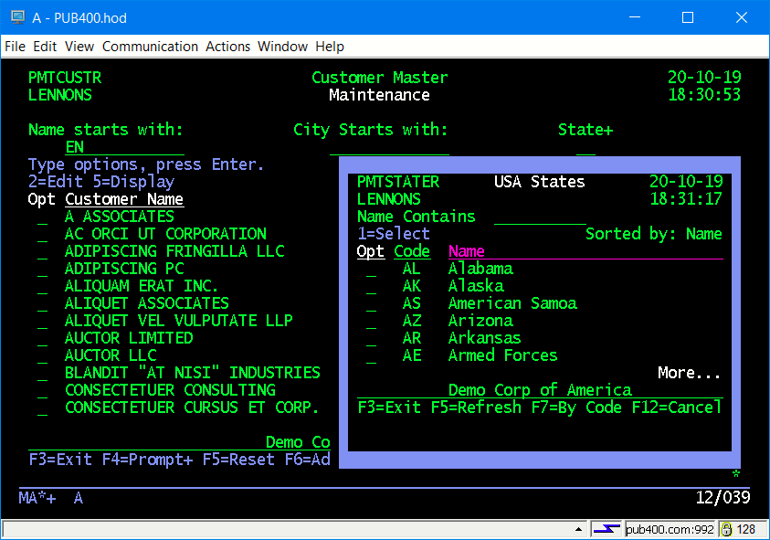

# 5250 Subfile: Full Screen and Windows

This is a working application that allows display, selection and maintenance of a customer master. The screens are _similar_ to what you see in PDM. The code is modular and there are several programs that can be called from multiple places.  SQL is used for all database IO. There are  "page at a time" subfiles (full screen and in a window) and a "load all" subfile in a window. The windows show a couple of border styles.

## Sample Inquiry Screens

## Sample Maintenance Screen

## Prompting to Select a State

## General Notes

Some of the programs use /Include statements, which are found in the Copy_Mbrs directory.

The genesis of these programs was code that I wrote in RPG IV for a Fortune 500 retailer circa 2002-2004. The code was then cloned as a standard approach by another team leader. This code is a more modern version that I cleaned up in 2020 and restructured again in late 2023.

My style tries to have consistent naming and I do not share field names between the RPG and the display files--I've seen too many accidental modifications in my support career.

The display file uses a private set of indicators, something I started doing to try to educate coworkers who were struggling with monolithic code where all 99 indicators were in use. You can also reset indicators and such in display files, but I prefer to do it myself.

### PMTCUSTR/PMTCUSTD

 RPG program that puts up a 5250 subfile that allows searching by customer name, city and state. Display of Inactive records can be toggled using F9.

 There are 3 functions, or modes, controlled by the first parameter passsed:  Inquiry to display a record; Maintenance to change a record; Selection to return a customer id.

        - I gives 5=Display
        - M gives 2=Edit 5=Display
        - S gives 1=select 5=Display
  If the cursor is in a field  with a + in the field name (ST+ here) you can press F4 to prompt the field.
  
  Conceptually, you can call this program from almost anywhere and control access to it  by whatever menuing or security system you have in place. The general user population would progably get Inquiry and Sales would have Maintenance. Selection could be used for any in-house program that needed to prompt for  a customer id number. 
  
  Note that this version uses a static SQL cursor, where City and State selection criteria use a "between" predicate. This differs from [the originally posted version](https://github.com/SJLennon/IBM-i-RPG-Free-CLP-Code/blob/master/5250_Subfile/PMTCUSTR.SQLRPGLE) which used a dynamic cursor which had to be prepared when the selection criteria changed. I think a static cursor makes coding easier and can improve performance since it doesn't need a "prepare". Conversely, on large files this approach may hurt performance. However, I tested the program on PUB400.COM with 1 million records and there was no discernable performance hit.

### MTNCUSTR/MTNCUSTD

  RPG program that maintains a customer.  Customer id is provided as the first parameter. It also adds or displays a customer. Function is controlled by the second parameter. It is called from PMTCUSTR, but it could be called from any program that has a customer id available, or which needs to add a customer.

  If the cursor is in a field  with a + in the field name (ST+ here) you can press F4 to prompt the field.

  The window has the default border, which may vary depending on which 5250 emulator you are using. The sample is using the iACS emulator from IBM.

### PMTSTATER/PMTSTATED

RPG program and window display file to prompt for a USA state code.  Called when F4 is used in PMTCUSTR or MTNCUSTR. Display can be sequenced by either state name or 2-character code, toggled by F7.

Strictly speaking, this is more of a demonstration program that may, or may not, have a lot of practical value in real life.

The window has a blue border of reverse image blanks. This will display consistently across most 5250 emulators.

#### CRTMSGF

  Creates the CUSTMSGF message file used by the programs.

#### CRTDTAARA
  
  Creates the CUSTNEXT data area that contains the next available customer id.

#### CustMast.SQL

  SQL code to create and populate the CUSTMAST table. You will need to change the _**set schema**_ in the first line to your target library.  You would put this file in the IFS and run it with the RUNSQLSTM command.

  Contains 300 randomly generate rows, courtesy of the fine folk at _http://generatedata.com/_, plus a little tweaking by hand.

### States.SQL

SQL Code to create and populate the STATES table, which is a table of USA state names and their 2-character abbreviations.

### Creating a large CUSTMAST

I have provided a program that will create as large number of fairly realistic random CUSTMAST records. To get a decent distribution of City, State, ZIP values I used a USPS file which you will have to upload from the USPS site.

#### LOADCUSTR.SQLRPGLE

This clears CUSTMAST and repopulates it with an many randon records are you specify. It requires the CSZ file, below. Typical usage is `call loadcustr 1000` to load 1,000 records. 

#### CSZ (City/State/ZIP) File

This file contains real data, over 40,000 records, dowloaded from the USPS website.

To create the CSZ file: 

- Download  the City, State and Zip database from USPS as an Excel spreadsheet. It is a free download at this [link](https://www.unitedstateszipcodes.org/zip-code-database/).

- Delete all columns except zip, type, primary city and state. Raname primary_city to city, save, but leave the spreadsheet open.

- Select all data in the speadsheet (this will fill in starting and ending colums and rows later).

- Using iACS "Data transfer to IBM i" upload the spreadsheet to file CSZ. 

    - In the Actions tab choose "Create IBM i Database file" and follow the prompts.

    - In "Change Data Options" set defaults of VARCHAR and INTEGER.

    - Keep following the prompts. 

    - Set Library/file to *yourlib*/CSZ.

Read this [IBM article](https://www.ibm.com/support/pages/transferring-data-excel-using-access-client-solutions) on uploading data from Excel using Access Client Solutions if you need more help.