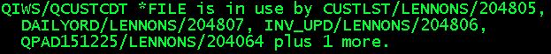
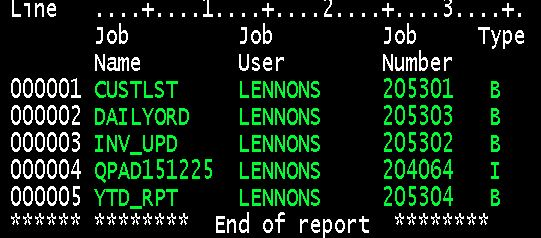

# APIs, including QWCLOBJL (List Object Locks), QUSLJOB(List Job) QUSCRTUS, QUSDLTUS, QUSPTRUS (User Spaces)

User commands that use RPG and CL to call IBM i APIs.

## QWCLOBJL (List Object Locks) API

In the late 90s the Fortune 500 company where I worked had contending overnight batch jobs from different project teams that required exclusive control of some files. Jobs kept breaking to the operator console when more than one tried running simultaneously. The night shift operator then had to do a WRKOBJLCK command to attempt to resolve the contention.

The code provided here is a command we could put in the driving CL program and when the ALCOBJ command failed it provided information on who had the object locked.

The company is long gone, but I recently found the code on my PC and resurrected it.

Now (2021) you can get similar information with SQL - see [Work Management Services](https://www.ibm.com/docs/en/i/7.4?topic=services-work-management) on the IBM site.  However, I have not found an SQL interface to QWCLOBJL. I also suspect that this code if faster than SQL, but probably in most use cases speed may not be a factor.

### GETOBJUSR Command

This is the top level interface. Prompted, it looks like this:

You specify the object and type and the command returns information on the locks on the object. You can return a file of objects and/or a message.

The file would be GETOBJUP in QTEMP.

The message would be suitable for sending to the operator and look something like one of these:

It shows the details of up to 4 jobs and lists how many additional jobs, if any, have locks.

### GETOBJUC

This the command processing program for the GETOBJUSR command.  It calls GETOBJUR to get the lock information.

### GETOBJUR

This RPG program creates a user space in QTEMP, then calls the QWCLOBJL (List Object Locks) API to populate the user spaces, calls SRTUSRSPC to sort by job, returns the requested message and/or file, then deletes the user space.

The code was originally in fixed form RPG/400, but I converted it to **FREE (using [Craig Rutledge's JCRCMDS](https://www.jcrcmds.com/)).

## GETOBJUP

DDS for the file created, if requested, in QTEMP. Resulting file contents look something like this:

### SRTUSRSPC

This program sorts a user space. I believe I downloaded the code from the Old News 3X/400 site.  It is fixed form RPG/400 that I haven't bothered to convert.  Old, educational, and it works.

## QUSLJOB (List Job) API

### GETJOBTR

This is a standalone program that returns the job type. GETOBJUR needed it, but I coded it separately in case it was useful elsewhere.

You pass it two parameters:

1. Input: The 26 char job name, user name and job number (or * for the current job)

2. Output: 1-character field to return the job type, as below.

Type|Description
----|--------------------------------
A|The job is an autostart job.
B|The job is a batch job.
I|The job is an interactive job.
M|The job is a subsystem monitor job.
R|The job is a spooled reader job.
S|The job is a system job.
W|The job is a spooled writer job.
X|The job is the SCPF system job.

Notes:

1. The code was originally fixed format but I converted it to **FREE (using [Craig Rutledge's JCRCMDS](https://www.jcrcmds.com/)). If needed for general use it should probably be a service program.  I'm not sure service programs were a thing in 1997, but if they were I was not familar with them then.
2. On more current OS releases you can get similar information in SQL with the [GET_JOB_INFO table function](https://www.ibm.com/docs/en/i/7.4?topic=services-get-job-info-table-function).

## Messages: QMHMOVPM (Move Program Messages) & QMHRSNEM (Resend Escape Message)

These commands makes handling CL program exceptions easy and concise. Source is an [article in IT Jungle](https://www.itjungle.com/2012/05/02/fhg050212-story01/) back in 2012. My thanks to Ted Holt and Brian Rusch.

### MOVPGMMSG - Move Program Messages Command

This is a command that calls the IBM QMHMOVPM (Move Program Messages) API. You'd use it to pass diagnostic messages up to the calling program.

### RSNESCMSG - Resend Escape Message Command

This is a command that calls the IBM QMHRSNEM (Resend Escape Message) API to send the current escape message to the calling program. This also ends the current program.

### CLERRHANDL - Ted Holt's CL Error Handler Template

This is execuatble code from Ted Holt that demonstrates handling exceptions in CL, using these two commands. When called it will fail and you will see the diagnostic message "From-file QCUSTCDT in *LIBL not found."
