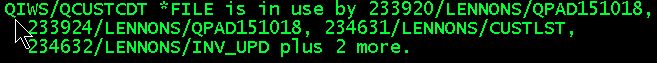
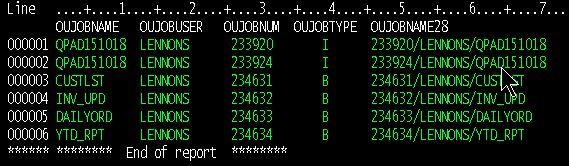

# Using IBM [Work Management Services](https://www.ibm.com/docs/en/i/7.4?topic=services-work-management)

IBM has begun providing access to APIs using SQL. The code here uses the QSYS2.OBJECT_LOCK_INFO SQL view.  This is shorter and simplified code that can be  used to replace the code in [APIs, which returns users who have a lock on an object](https://github.com/SJLennon/IBM-i-RPG-Free-CLP-Code/tree/master/APIs).

## GETOBJUSR.CMD

This command is the top level interface. It is unchanged from the version in [APIs](https://github.com/SJLennon/IBM-i-RPG-Free-CLP-Code/tree/master/APIs), but it provided here for completeness.
 Prompted, it looks like this:

You specify the object and type and the command returns information on the locks on the object. You can return a file of objects and/or a message.

The returned message would be suitable for sending to the operator and look something like one of these:

It shows the details of up to 4 jobs and lists how many additional jobs, if any, have locks.

A job name can be copied and pasted into a WRKJOB command, e.g. `wrkjob 233920/LENNONS/QPAD151018`.

The returned file is GETOBJUP in QTEMP.

## GETOBJUP File

If requested, this file is created in QTEMP. The contents would look like this:

## GETOBJUC.CLLE

This is the command processing program for the GETOBJUSR command. It does some housekeeping and calls GETOBJUR. Unlike the version in [APIs](https://github.com/SJLennon/IBM-i-RPG-Free-CLP-Code/tree/master/APIs), it does not need to create QTEMP.GETOBJUP.

## GETOBJUR.SQLRPGLE

This creates QTEMP/GETOBJUP if requested, using SQL. Then it retreives the job name using the QSYS2.OBJECT_LOCK_INFO view, and orders it by job name. It populates file GETOBJUP using SQL.

This about 100 lines shorter then the version in [APIs](https://github.com/SJLennon/IBM-i-RPG-Free-CLP-Code/tree/master/APIs) and it does not need the SRTUSRSPC program.

## T0/T1/T2/T3.CLLE

These are simple CL programs to test GETOBJUSR and display the results by sending a message and/or displaying the QTEMP/GETOBJUP file.

## T9xxx.CLLE

More complex testing:

- First, call T9ALLOCMNY to create a interactive lock and several batch locks on QIWS/QCUSTCDT.

- Then call T9DSPMNY to display the locks.

- T9ALLOC1 creates a lock on QIWS/QCUSTCDT. It is called by T9ALLOCMNY.
