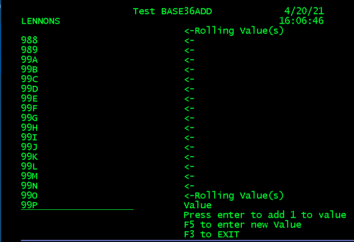
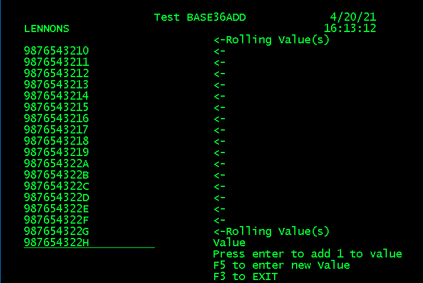

# BASE36 - Add 1 to an Alpha-Numeric String in RPGLE

This is a service program that adds 1 to an alpha-numeric string. The string can be any (sensible) length but is currently set at an arbitrary max of 50 characters.

The code was originally developed to help out when a numeric key (kept in a character field) was about to hit the maximum, and the company did not want to re-structure their database. Instead, they wanted to use A-Z in the number, so that incrementing 899999 would give 9AAAAA. (See [midrange.com](https://archive.midrange.com/midrange-l/201506/msg00533.html) for the  thread the the other suggested solutions.)

 I had developed a solution back in RPG III days so converting it to RPGIV was a trivial task.

Another potential use might be incrementing a unique alpha numeric part number.

The code is quite short and can be easily modified to change the maximum length.

It is currently set to use a BASE36 character set (A-Z and 0-9) and the raw EBCDIC code sorting sequence, where numbers are higher than characters. Changing either the character set or the sorting sequence simply requires changing two constants.

**Note:** This is *not* a BASE36 math  package. It covers just the case of adding 1 to a string.

## Development

I've been experimenting with the **free** [Visual Studio Code](https://code.visualstudio.com/) and the [Code for IBM i](https://halcyon-tech.github.io/code-for-ibmi/#/) :+1: extension to VS Code, so using that I tidied up the code, made it into a service program, made it more flexible and wrote some testing code. Lots of fun and a good learning experience using the new, totally free, D-specs :smile:

## SRV_BASE36

This is the service program.  It contains the BASE36ADD procedure. You call it with a value and it returns the value + 1.
A typical call might be:

`valVar = BASE36ADD(ValVar);`

where ValVar is defined as varChar.

## BASE36_P

This is the prototype for the BASE36ADD procedure.

## BTBR

A batch program that exercises BASE36ADD. You call it with a starting and ending value and it writes the results to **file BTB**. A typical call might be like this:

`CALL PGM(BTBR) PARM('988' '992')`

This program drops (deletes), creates and writes to the file using SQL. I wanted to try this to avoid creating DDS for the file.

BTIR/BTID

A  program to explore BASE36ADD interactively. You enter a starting value and each successive enter adds to a rolling display of values.  Like this:

Or this, with a longer value:

