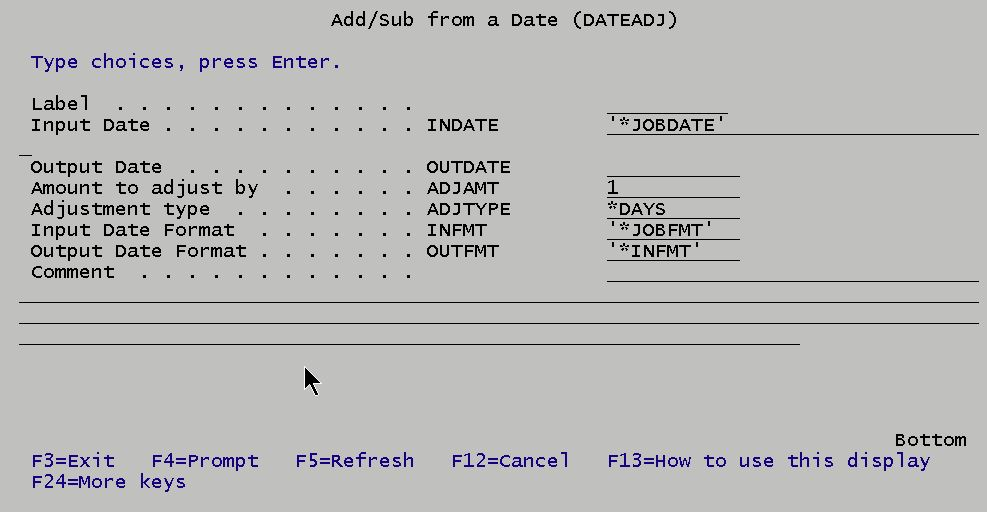

# DATEADJ - A command to add or subtract from a date in a CL program.

Date arithmetic in CL programs is limited and lacks the simplicity and scope found in RPG. 

The DATEADJ command adds the functionality of RPG date handling to CL programs. 

DATEADJ adds or subtracts days, months or years from a date and returns an adjusted date. Input and output dates can be in almost any format that RPG recognizes. It can also be used to just change the format of a date by specifying an adjustment of 0.

A prompted DATEADJ command looks like this:



|Parameter|Description                              |
----------|----------------------------------------------|
|Input date|Can be *JOBDATE to use the job date, or *SYSTEM to use the system date, or a character date value, e.g. 12/31/99.
|Output Date|The adjusted date is returned here|
|Amount to adjust by|The adjustment amount.  Positive to add to the date or negative to subtract from the date. Zero is also allowed, which allows you to simply reformat a date.|
|Adjustment type|Defines the type of the adjustment amount: *DAYS, *MONTHS or *YEARS.|
|Input Date format|Specifies the format of the input date. It allows nearly all the date formats that RPG allows, *YMD, *MDY, *DMY, *ISO, *JUL, etc., with or without delimiters. It also allows *JOBFMT for an input date in job format and *SYSTEM for an input date in system format. (Input date format does not apply if Input date is *JOBDATE or *SYSTEM, since these are predefined by the operating system.)|
|Output Date Format|Defines the format of the returned date. It allows all the input formats, plus it defaults to *INFMT to specify the same format as the input date.

## Simple DATEADJ Usage Examples

``` 
/* Tomorrow */
    DATEADJ    INDATE(*SYSTEM) OUTDATE(&NEWDTE)
/* Yesterday*/
    DATEADJ    INDATE(*JOBDATE) OUTDATE(&NEWDTE) ADJAMT(-1)
/* Day before arbitrary date & reformat */
    DATEADJ    INDATE('2019-03-21') OUTDATE(&NEWDTE) +
                ADJAMT(-1) INFMT(*ISO) OUTFMT(*JOBFMT)
                          OUTFMT(*INFMT)
```
## Complex DATEADJ Usage Example
```
/* Calculate last month beginning and ending dates */
    DCL        VAR(&THISDAY) TYPE(*CHAR) LEN(2)
    DCL        VAR(&ADJ) TYPE(*CHAR) LEN(3)
    DCL        VAR(&WKDATE) TYPE(*CHAR) LEN(10)
    DCL        VAR(&EOML) TYPE(*CHAR) LEN(10)
    DCL        VAR(&BOML) TYPE(*CHAR) LEN(10)
/* Adjustment is minus day value of today in system date*/
    RTVSYSVAL  SYSVAL(QDAY) RTNVAR(&THISDAY)
    CHGVAR     VAR(&ADJ) VALUE('-' *TCAT &THISDAY)
/* Last day of last month */
    DATEADJ    INDATE(*SYSTEM) OUTDATE(&EOML) ADJAMT(&ADJ)
/* 1st day of this month */
    DATEADJ    INDATE(&EOML) OUTDATE(&WKDATE) ADJAMT(1)
/* 1st day of last month */
    DATEADJ    INDATE(&WKDATE) OUTDATE(&BOML) ADJAMT(-1) +
                ADJTYPE(*MONTHS) INFMT('*SYSTEM')
    SNDMSG     MSG('Last month is' *BCAT &BOML *BCAT +
                'through' *BCAT &EOML) TOUSR(*REQUESTER)
```
## DATEADJ.CMD
This is the source for the command

## DATEADJP.PNLGRP
This is the UIM source for the command help.

## DATEADJR.RPGLE
This is the command processing program that converts the input character date to a date datatype, does the arithmetic, then converts the result to a character date for output.

## DATEADJC.CLLE
This is a very short CLLE helper program for DATEADJR to get JOB and SYSVAL settings. 

## T1R.RPGLE/T1C.CLLE
Extensive test program.

## T2C.CLLE
Quick and dirty test program

## T3C.CLLE
Test calculation getting first and last dates of last month.

## Coding Comments
DATEADJR is not a complex RPG program, and adding additional custom date formats should be easy. Probably the most complex part was ensuring that all the input and output formats were covered and each had a test case. 

For completeness, I created a help panel group (DATEADJP.PNLGRP). If you want to add help to your own commands, I recommend starting with **IBM's GENCMDDOC** command to give you a basic outline. (If you want additional background on the UIM markup language used in help panels, it is hard to find. IBM pointed me to the [Application Display Programming PDF](http://public.dhe.ibm.com/systems/power/docs/systemi/v6r1/en_US/sc415715.pdf).) 

While SEU will edit panel groups, it is vastly simpler to use a GUI editor. My current editor of choice is the free [Code for IBM i](https://halcyon-tech.github.io/vscode-ibmi/#/) extension to VS Code. 

I doubt if execution speed is a consideration, because I see DATEADJ generally being executed only at the start of a job. That being said, my test program runs the command over 70 times and on PUB400.COM it completed in under 1 second and used 0.041 processing units.

## Feedback
If you find any bugs, or have any comments, or know any better way to provide this functionality to a CL program I'd like to hear about it.