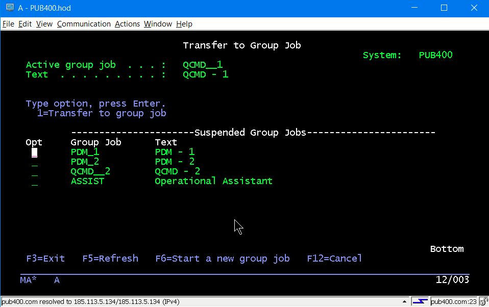

# GRP_JOB - Sets up Group Jobs Suitable for a Developer

A 5250 interactive session may be split up into "Group Jobs". You can jump from job to job using the
5250 Attn key. Each job is independent of all others, with it's own QTEMP, overrides, etc. The only thing
shared is the Group data areas, the *GDA.

If your shop limits you to only one or two concurrent interactive sessions you may find group jobs useful. Even if you are not limited you still may find group jobs useful.

You can have up to 16 group jobs in an interactive session. When you hit the Attn key, this code sets up 5:

1. QCMD 1
2. PDM 1
3. PDM 2
4. QCMD 2
5. Operational Assistant

I have found 5 is somewhere around my sanity scope. You can very easily add more if you so desire, or open up SEU instead of PDM. In past jobs I've had Hawkeye sessions and Aldon sessions as well.

## System Impact

The system impact is minimal--only the current group job is active.  The others are suspended and presumably will be paged out eventually. You can transfer to another group job only when your current job is waiting for keyboard input.

## Development

Code research is often a major part of a developer's work. Before I had access to a GUI environment (think RDi or VSCODE with the Code for IBM i extension) I hated losing context by backing out of SEU to look at source in another member. I know SEU can split the screen, but a split doesn't show you a lot of real estate. Much easier to hit the attenntion key and open up another SEU instance. Or when debugging in one QMCD session, jump to another group job to research whatever, or run SQL, or ...

## GRP

This is the program that sets up the group jobs. You call it after you sign on, e.g. CALL GRP.

## GRP_LIBL

This is called from GRP to set your development library list. All group jobs will inherit this.  It could be coded inside GRP, but I have it separated out so I can use it in other places.

## GRP_INIT

This program is called from GRP to establish each group job. The command it runs is passed from GRP in the *GDA.

## GRP_ATN

This is called when the Attn key is pressed. **Shift+Esc is the Attn keys in most 5250 emulators.** It pops up a very functional but effective IBM menu to pick another group job.
