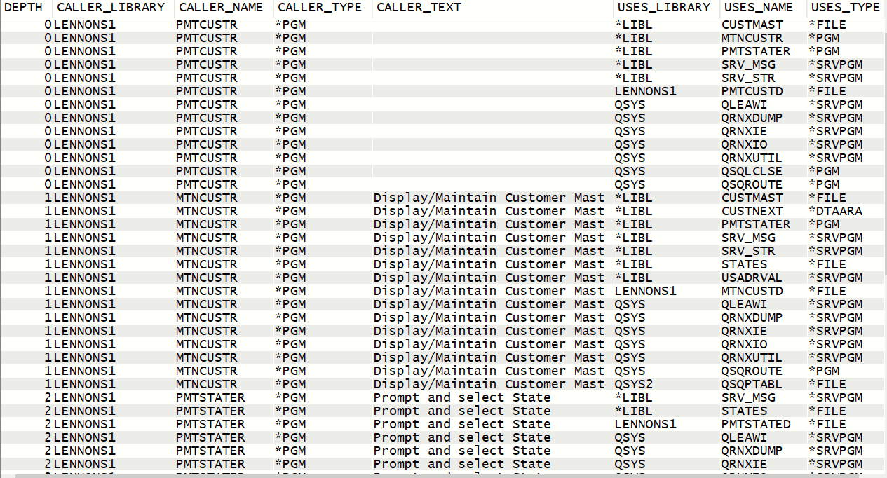

# SQL Procedure to find Program Usage recursively using DSPPGMREF

Given a program (or any of the objects that DSPPGMREF handles), the PGM_REFS procedure will find all the obects that the program uses, and then recursively find all that objects that they use, and so on, to an essentally unlimited depth.

This is the product of my experimentation with PL/SQL. It may be short on error handling, and it doesn't do any validity checking on the paremeters.

If you have more experience than me, please feel free to suggest better coding techniques.

So far I have not found a decent manual or turorial. If you have any I'd like to know. 

My primary source was trial and error, with help
from these articles by Ted Holt in IT Jungle:
    [Ted HolT Article 1](https://www.itjungle.com/2017/06/12/guru-error-handling-sql-pl-part-1/) and 
    [Ted Holt Article 2](https://www.itjungle.com/2017/10/16/guru-error-handling-sql-pl-part-2/)
and browsing [Scott Forstie Gists on Github](https://gist.github.com/forstie
)

In no way does this replace a real cross reference utilily, such as Hawkeye
or X-Analysis. If you don't have one, this might be somewhat useful.

## pgm_refs_Tbl.sql

This is the DDL to create the file that the procedure builds. 

Change the library and then run this first.

## pgm_refs.sql
This is the code to create the PGM_REFS procedure. The library in which the REFS file is build needs to be changed to suit your environment.

## pgm_refs_test.SQL

These are some samples of calling the procedure to test it. I used iACS Run SQL scripts. You could also call it in a CL program using the RUNSQLSTM command.

## Sample Output File Contents

