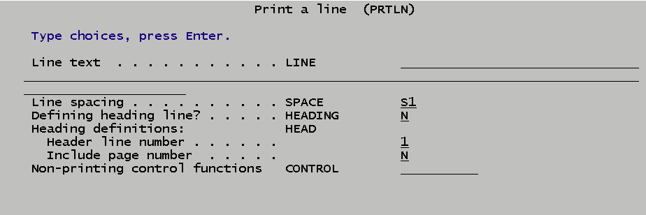
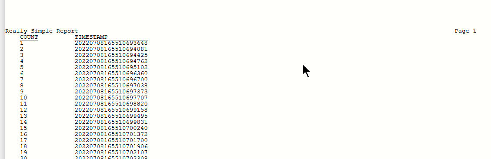
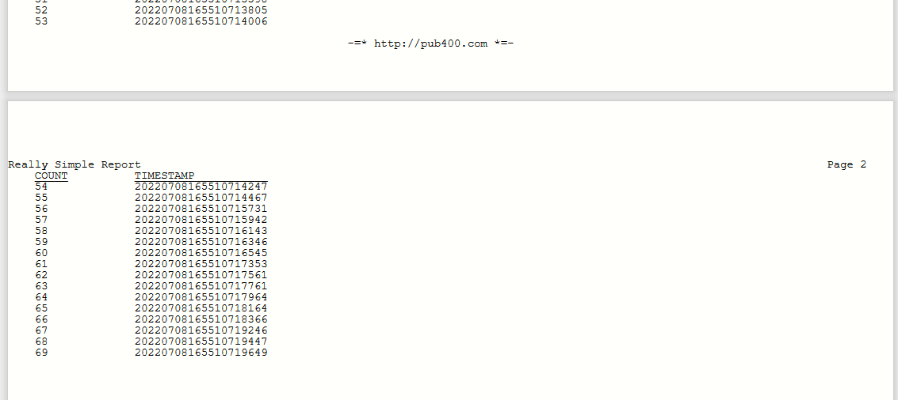
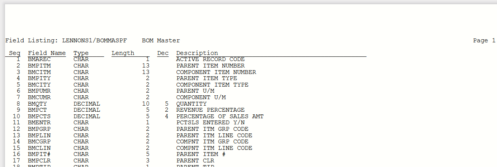

# Printing from a CL program (The PRTLN command)

Generating a report from an IBM i CL program isn’t straight forward, because in CL there is no direct way to write to a spool file.  Here I  provide the CL PRTLN command, which allows simple, direct printing from a CL or CLLE program, including page control and headings.

(Note: I'm not suggesting you should do your payroll checks or month-end general ledger from CL--use RPG for that. But sometimes it is just convenient to print from CL without bothering with extra objects, like Query/400, or STRQMQRY or an RPG program.)

## The PRTLN Command

The PRTLN command allows you to:

- Print a line to a spool file with single, double, or triple spacing, or overprinting.

- Define zero to nine heading lines that print on overflow.

- Print a page number in a heading line.

- Force a new page if you want break handlling.

Fully prompted, the PRTLN command looks like this:



### Line text

Specifies the text to print on this line, or if defining a header line, specifies the text of that header line. 

### Line spacing

Specifies the spacing of the printed line or the header line. (S1: Space 1 line and print; S2: Space 2 lines and print; S3: Space 3 lines and print; S0: Overprint previous line.)

### Defining heading line?

Y means this is a header line definition.

### Header line number

Specifies which heading line is being defined, 1 through 9.

- Heading lines can be defined in any order. For example, you can define heading 9, then define heading 1, then define heading 3, etc.   

- Heading lines always print in ordinal order, not the order in which they were defined.

- A heading line that is not defined does not print.

- A heading line may be defined with blank text and will print a blank heading line.

- Once defined, a heading line cannot be undefined.

- A heading line may be redefined at any time and will take effect at the next page break.  Normally you would force a page break after redefining a heading line.

### Include page number
Y to print a page number in the rightmost 8 positions of this header line.

### Non-printing control functions

These are operations which are not related to printing a line or defining headings.

- *NEWPAGE forces a new page when the next line prints. (Page overflow and header printing is handled automatically, so you need to use this only if you have break handing logic in your program.)

- *CLOSE closes the print file.  Normally you do this at the end of the report, but you can use it to create a new spool file..

## Formatting the Print Line

In [Printing Techniques in RPG/**FREE](https://github.com/SJLennon/IBM-i-RPG-Free-CLP-Code/tree/master/Printing) I showed how easily RPG can format print line columns using a data structure. CL doesn't have data structures, but they can be simulated using the STG(*DEFINED) and DEFVAR parameters of the DCL command. This is much simpler than building the print line through concatenation.

 As an example, you can define a print line with 3 columns like this:
```
    DCL (&LINE)  (*CHAR) LEN(132)
    DCL (&LIB)   (*CHAR) STG(*DEFINED) LEN(10) DEFVAR(&LINE)
    DCL (&FILE)  (*CHAR) STG(*DEFINED) LEN(10) DEFVAR(&LINE 12)
    DCL (&MBR)   (*CHAR) STG(*DEFINED) LEN(10) DEFVAR(&LINE 33)

```

Then you just need to populate the line using the column names.

 ## PRTLN Example

Here's a simple program to demonstrate the concepts.

```PGM
DCL   (&LC)    (*DEC) LEN(5 0) VALUE(1)
DCL   (&UNDER) (*CHAR) LEN(20) VALUE('____________________')
/* Define print line and columns */
DCL   (&LINE)  (*CHAR)  LEN(132)
DCL   (&COUNT) (*CHAR) STG(*DEFINED) LEN(5) DEFVAR(&LINE 5)
DCL   (&STAMP) (*CHAR) STG(*DEFINED) LEN(20) DEFVAR(&LINE 20)
/* Define heading 1 */
PRTLN  LINE('Really Simple Report') HEADING(Y) HEAD(1 Y)
/* Define heading 2 */
CHGVAR &COUNT 'COUNT'
CHGVAR &STAMP 'TIMESTAMP'
PRTLN  LINE(&LINE) HEADING(Y) HEAD(2)
/* Define hading 3 Underscoring heading 2 */
CHGVAR &COUNT &UNDER
CHGVAR &STAMP &UNDER
PRTLN  LINE(&LINE) SPACE(S0) HEADING(Y) HEAD(3)
/* Print a report showing count and timestamp */
DOWHILE COND(&LC *LT 70)
    CHGVAR &COUNT %CHAR(&LC)
    RTVSYSVAL SYSVAL(QDATETIME) RTNVAR(&STAMP)
     PRTLN   LINE(&LINE)
    CHGVAR   VAR(&LC) VALUE(&LC + 1)
ENDDO
PRTLN CONTROL(*CLOSE)
ENDPGM
```

It produces a two page report like this:




## The Code

### PRTLN.CMD

This is the source for the PRTLN command.

### PRTLNCV.CLLE

This is the VCP (Validity Checking Program) for the PRTLN command. A VCP is optional and can be used to do parameter validity checking that is difficult or impossible in standard command definition source.  When used, it receives the same parameters as the CCP and can pass back error messages to the command. 

It is used here to ensure that non-printing CONTOL functions don't also try to print a line or define a heading.

### PRTLNC.CLLE

This is the CPP (Command Processing Program). A CPP is called when there are no errors in the command.  

Here it reformats the parameter from the command to pass to the PRT program.

### PRTLNP.PNLGRP
This is the UIM help text for the PRTLN command. I created a skeleton using the IBM GENCMDDOC command, then edited it with the [Code for IBM i](https://github.com/halcyon-tech/vscode-ibmi) extension to VS Code.


### PRT.RPGLE
This is a RPG/FREE program that does the heavy lifting. It saves heading lines in an array, takes care of opening and closing the print file and prints headings on overflow.

It writes to the MYPRINT printer file which is defined like this:
```
    CRTPRTF FILE(LENNONS1/MYPRT) DEVTYPE(*SCS) 
            PAGESIZE(66 133) LPI(6) CPI(10) 
             OVRFLW(60) CTLCHAR(*FCFC) CHLVAL((1 (6))) 
             FONT(*CPI)
```             
Adjust the overflow or top of form line to suit your needs.

MYPRT.CLLE is a simple CL program to create MYPRT.

### DEMO_CL1.CLLE

 A "Really Simple Report" 

### DEMO2_CL2.CLP

A more complex report that lists the files, member names, member record count and member description for a set of files. Adjust the file set to suit your needs.

### DEMO_CL3.CLLE

Even more complex report printing a file member list for a library with the library name in the heading, breaking on file name and with an "End of Report" page at the end. To generalize, make the library name a parameter.

### DEMO_RPG1.SQLRPGLE

A demonstration RPG/**FREE program calling the PRT program directly to print a a file layout. It produces a report like this:



### More on PRT.RPGLE

I also wanted PRT to be easily called from RPG as well as from the PRTLN command. While RPG parameters can be omitted or optional, they are still positional and not quite a flexible as defining and defaulting parameters in a command. So I opted for just two parameters, the second being optional.

Parm 1 is the line text, either to print or to define a heading.

Parm 2 is a multipart control parameter that qualifies Parm 1.
- If blank or omitted. the line text in Parm 1 is printed with single spacing.
- Spacing Control when printing Parm 1
    - __S1__    Space one line and print. (Omitted or blank is the same as S1.)
    - __S2__    Space two lines and print.
    - __S3__    Space three lines and print.
    - __S0__     Overprint current line.
- Defining - no lines are printed with this call.
     -  __*Hn__      Define heading line "n", where n is 1 to 9. Parm 1 can be all blanks to print a blank  heading line.
    - __*Hn:Sx__    Define heading line "n", where n is 1 to 9 and "x" is the number of lines to space, where
  x is 0 to 3. S0 will overprint prior line.
    - __*Hn:*P:Sx__ Page number will be printed at the end of this header line.

- Non Printing functions - 
    -   __*CLOSE__ Close the print file. Must be done at the end of the report. Parm 1 is ignored.
    -   __*NEWPAGE__ Next line will print on a new page. Parm 1 is ignored.  

Parm 2 values are separated by a "__:__" as in RPG. I used the new %SPLIT BIF to take parse Parm2 into a variable length autosized array. 
```
dcl-s   ctlValues   varchar(4) dim(*auto : 3);
%elem(ctlValues) = 0;
ctlValues = %split(wk_Ctl :':'); 
```
It is very easy to split up parms this way. You do need to be aware that any leading and trailing blanks are included in the array elements and you need to %TRIM them.
