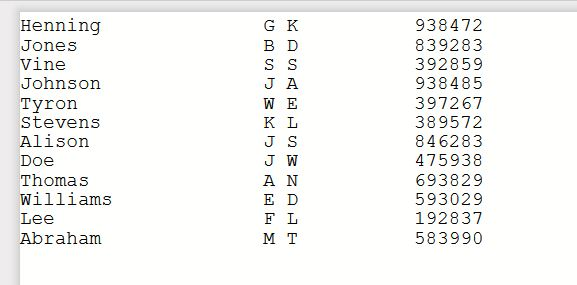
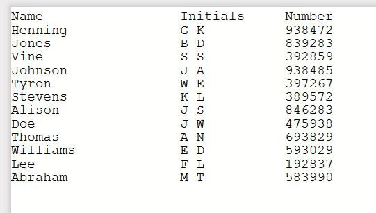
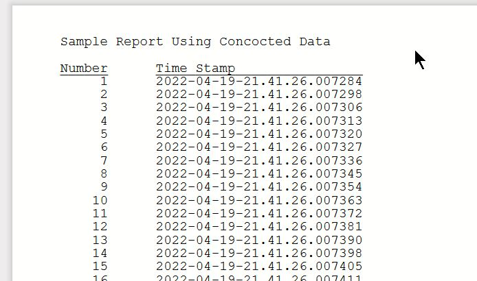
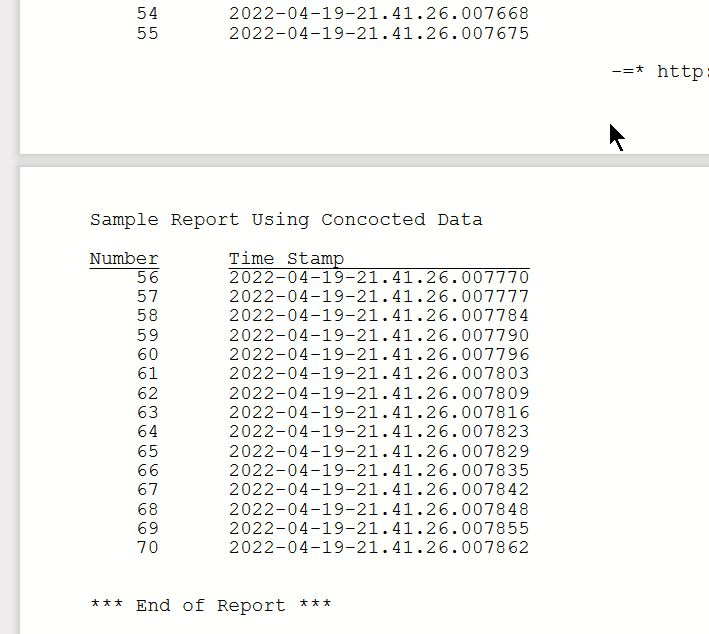

# Printing Techniques, from RPG and CL.
# (Under construction)
##  Printing without O-Specs or Externally Defined Printer Files
IBM has made just about everything in free format RPG truly free format. Except O-specs. Instead of adding free format support for O-specs, IBM expects you to use a separately externally defined printer file. This can can do everything O-specs can, but is an extra object. 

But you can print without needing an externally defined printer file.

It turns out to be easy in free form RPG, writing from a data structure, with code like this:
```
    dcl-ds line len(132) end-ds;
    write QPRINT line;
```
The easiest way to populate the date structure is to create "columns" of data. Something like this:
```
**free
ctl-opt option(*srcstmt) actgrp(*new) main(Prt);
dcl-f   QCUSTCDT Disk extfile('QIWS/QCUSTCDT');
dcl-f   QPRINT printer(132);
dcl-proc Prt;
    dcl-ds line len(132) inz qualified;
        custname    char(20);
        *n          char(1);
        custinit    char(10);
        *n          char(3);
        cusnum      char(6);
    end-ds;
    read QCUSTCDT;
    dow (not %eof(QCUSTCDT));
        line.cusnum = %char(CUSNUM);
        line.custname = LSTNAM;
        line.custinit = INIT;
        write QPRINT line;
        read QCUSTCDT;
    enddo;
    return;
end-proc;
```
If you run this, you get a nicely spaced report from file QIWS/QCUSTCDT data:


Let me express my thanks to **Cletus the Codeslinger** for the origin of this technique. [He wrote about this way back in 2004.](https://www.itjungle.com/2004/04/14/fhg041404-story02/)

Once you've defined the columns, heading are easy. Add code like this:
```
    dcl-ds head likeds(line);
    head.custname = 'Name';
    head.custinit = 'Initials';
    head.cusnum = 'Number';
    write QPRINT head;
```
Run it, and voila, column headings:



To handle page overflow, you use the OFLIND on the printer file:
```
dcl-f   QPRINT printer(132) oflind(*in99);
```
To skip to a new page or other wise control spacing, there are two options:
1. Use a PRTCTL data structure.
```
    dcl-f   QPRINT printer(132) oflind(*in99) prtctl(pCtl);
    dcl-ds  pCtl len(15) qualified inz;
    sp_b4    char(3);   // Space before
    sp_aft   char(3);   // Space after
    sk_b4    char(3);   // Skip to line num before
    sk_aft   char(3);   // Skip to line num after
    linenum  char(3);
```
You can find IBM [PRTCTL documentation here.](https://www.ibm.com/docs/en/i/7.4?topic=structcompat-extended-length-prtctl-data-structure)

2. Use First Character Forms Conrol (FCFC).
    In FCFC, the first character of the print line controls spacing and skipping. (This [Wiki article gives a decent overview of FCFC.](https://en.wikipedia.org/wiki/ASA_carriage_control_characters) There's an [IBM document here.](https://www.ibm.com/support/pages/list-fcfc-controls-and-their-meanings))
   ```
    FILE(MYPRT) CTLCHAR(*FCFC) CHLVAL((1 (3)))
    dcl-c TOP '1';       // Skip to top of page & print
    dcl-c S1  ' ';       // Space 1 line & print
    dcl-c S2  '0';       // Space 2 lines & print
    dcl-c S3  '-';       // Space 3 lines & print
    dcl-c S0  '+';       // Space 0, overprint
    ```
I chose to use FCFC, though in his article Cletus used a PRTCTL data structure.

I think that FCFC is quicker to code for simple reports, but PRTCTL data structure gives more control over skipping and spacing before and after printing.

For your perusal, I have provided demo code that produces the same report written both ways and produces a report like this:



### DEMOFCFC.RPGLE
Demo program to produce a report using First Character Form Control (FCFC)

### DEMOPRTCTL.RPGLE
Demo program to produce a report using a PRTCTL data structure.
