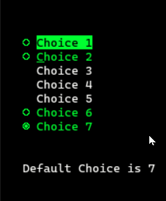
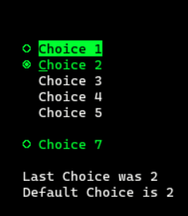
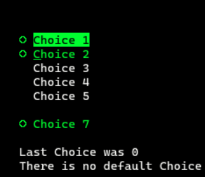

## SNGCHCFLD/MLTCHCFLD DSPF Keywords

The question asked was "How can I use the keywords SNGCHCFLD/MLTCHCFLD in protected mode?"

I had never used these pseudo graphical 5250 features, so all I could initially do was point to the IBM documentation for [SNGCHCFLD (Single-Choice Selection Field)](https://www.ibm.com/docs/en/i/7.5?topic=dkedfp4t8-sngchcfld-single-choice-selection-field-keyword-display-files) and 
[MLTCHCFLD (Multiple-Choice Selection Field)](https://www.ibm.com/docs/en/i/7.5?topic=dkedfp4t8-mltchcfld-multiple-choice-selection-field-keyword-display-files) keywords.

Another user pointed to the [CHCCTL](https://www.ibm.com/docs/en/i/7.5?topic=80-chcctl-choice-control-keyword-display-files) documentation.

I remembered that the late Booth Martin had extensive DSPF examples at his [website](https://martinvt.pocnet.net/index.html).

Based on what Booth had done, I created this program to demonstrate what could be done to hide and protect single choice selections fields.

When program BOOTH is called, the display looks like this, with Choice 7 already selected by default:

Select a choice with your mouse of using the down and up arrow keys and the space bar.

Selecting Choice 2 and pressing enter show this: 

Every other time you press enter Choice 6 appears or disappears, by flipping *IN01.

If you clear the default selection and make no selection, then zero is returned for that choice:

### Booth.DSPF
 The display file.

 ### Booth.RPGLE

 A *minimal* program to drive the display file, deliberatly kept short.