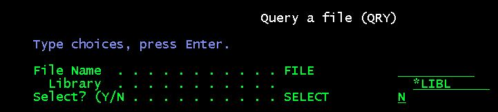
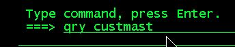
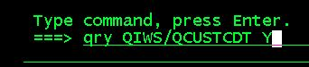
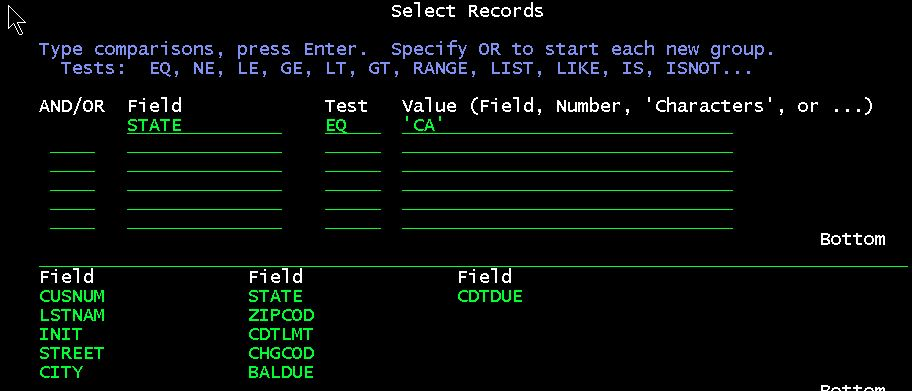
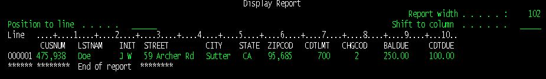
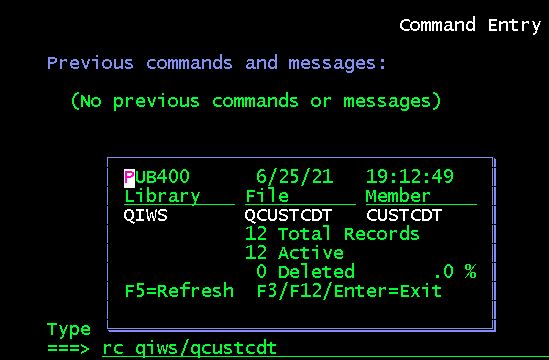
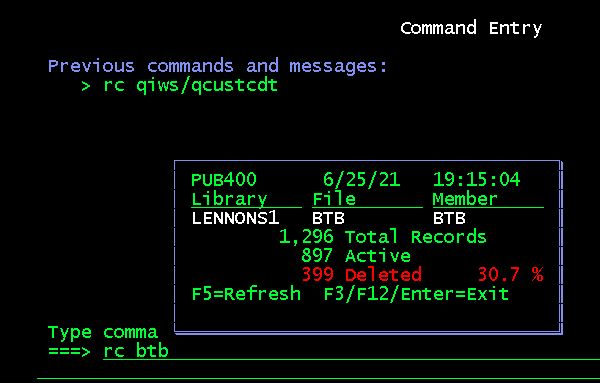
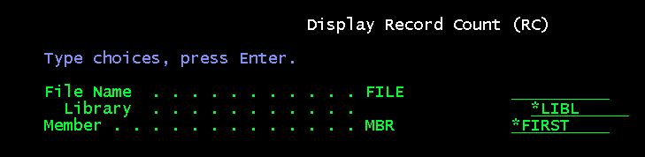
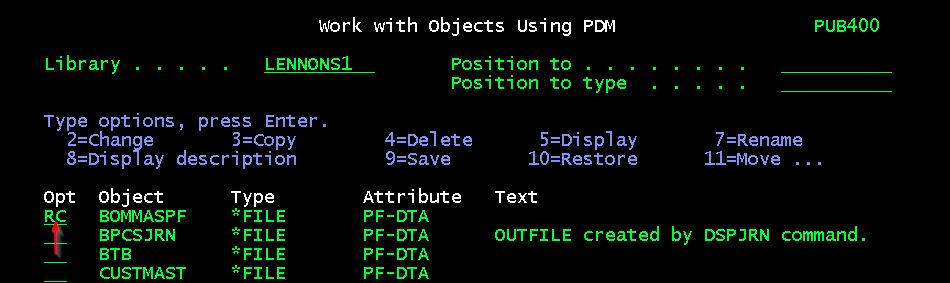
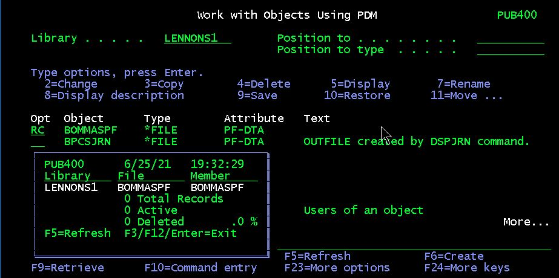

These are personal utility commands that I wrote somewhere in my career. They made my life easier. Maybe they will make your life easier.

And you can see some examples of simple command definitions.

# QRY - Query (List) File Contents

This just a quick and dirty shorthand way to look at the contents of a file. You probably know that you can list the contents of a file by `RUNQRY *NONE filename`. I got tried of typing the *NONE and instead wanted to simply  enter `QRY filename`. Hence this command.

QRY invokes RUNQRY internally. RUNQRY is the runtime component of the old Query/400 product. It you understand Query/400 and you really want to, you can tell QRY to open up for  entry  of selection criteria.

### Typical QRY, file in library list

### QRY With Selection, specifying the library

This opens up the RUNQRY selection dialog:

With results like this:

## QRY

The command source

## QRYC

The CLP command processing program

# RC - Display File Record Count

This provides a popup window showing the number of records in a file.

It also shows the number of deleted records. If there are greater than 10% deleted this is highlighted:

You can press F5 and watch any add or delete activity on the file.

RC defaults to the *FIRST member, but you can specify a member:

I also have a PDM User-Defined RC option: `RC FILE(&O/&N)`.  So in PDM I can do:

which gives this:

## RC

The command source

## RCC

The CLLE source of the command processing program

## RCDD

The display file for the window
