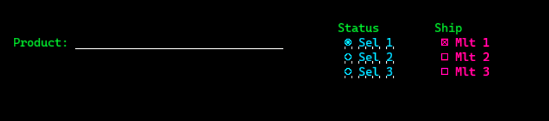
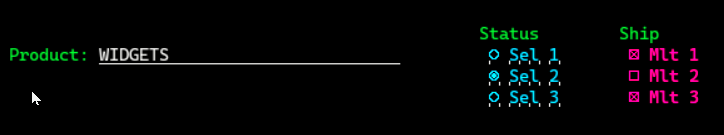
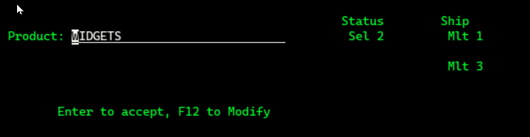

# Experimental Stuff
This is code that may come and go. It is usually minimal and may reflect my usual standards and approach.

## Protection of SNGCHCFLD & MLTCHCFLD Display File keywords

A user asked how to protect SNGCHCFLD and/or MLTCHCFLD fields on a display. As far as I can tell, he wanted to protect the fields on a confirmation screen, before accepting changes. 

It seems there is no way to do that, because you cannot use an indicator on these fields.

This is a work around where the the choices are redisplayed as normal fields in place of the SNGCHCFLD & MLTCHCFLD fields.
 
## B2.DSPF 
This is the display file. It is as minimal as possible to demonstrate the process and was cribbed initially for the original questioner's DDS.

The initial display looks like this:

 

Make entries and choices, perhaps  like this:

Press enter and see this confirmation screen:

Press F12 and you are back to the original entry. Enter exits the program.

## B2.RPGLE

The driving RPGLE. The choice fields are in an array and can easily be changed with minimal effort.